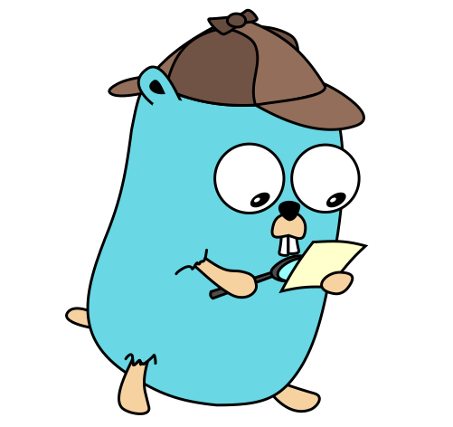
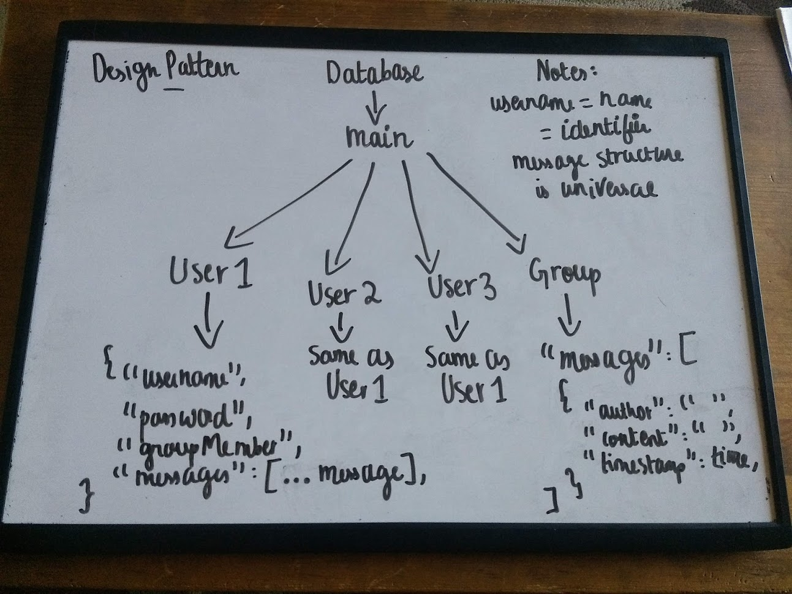

# GopherChat
\
A simple chat app written in Go that allows you to message other people using the terminal. It is an extension of Revochat, with direct message (DM) features that allow the user to send messages directly to another user without having to put the message in a group where other registered members can see it
## Key Features
- Huge performance improvements
- Usage of Cloud Firestore to store messages, which makes it much more secure than Realtime Database
- Far fewer dependencies, and solid builds and dependency management
- Cross Platform, which means that the source code can be built for any platform 
## Packages/Tools Used
Special thanks to these tools and libraries for making this project possible :)
- `firebase.google.com/go` for Firestore Client
- `fatih/colors` for Colourful Terminal Output
- `golang.org/x/term` for Password Input
## Installation
### MacOS/Linux (Arch: x64/arm64/386)
``` bash
wget https://github.com/MahanthMohan/GopherChat/blob/main/bin/{os}/{arch}/main
wget https://github.com/MahanthMohan/GopherChat/blob/main/credentials.json
```
### Windows/NT (Arch: x64/arm)
``` powershell
iwr -useb https://github.com/MahanthMohan/GopherChat/blob/main/bin/windows/{arch}/main.exe
iwr -useb https://github.com/MahanthMohan/GopherChat/blob/main/credentials.json
```
### Run
```
./chat
```
## Design Pattern

